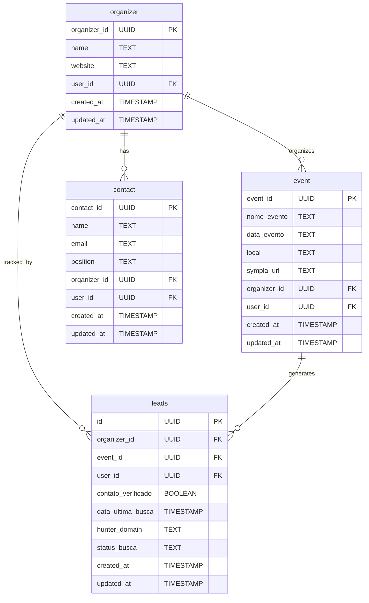

# Database Migration Instructions

## Overview

Your database has been restructured from a monolithic `leads` table to a normalized schema with separate tables for organizers, events, contacts, and leads. This provides better data integrity, performance, and scalability.

## New Database Structure



## Step 1: Execute Database Migration

### Manual Migration in Supabase Dashboard

1. **Backup your database** before starting
2. Go to your Supabase Dashboard → SQL Editor
3. Execute the following scripts **in exact order**:

#### 1. Create Organizer Table
```sql
-- Copy and execute the entire content of sql/05_create_organizer_table.sql
```

#### 2. Create Event Table
```sql
-- Copy and execute the entire content of sql/06_create_event_table.sql
```

#### 3. Create Contact Table
```sql
-- Copy and execute the entire content of sql/07_create_contact_table.sql
```

#### 4. Migrate Existing Data
```sql
-- Copy and execute the entire content of sql/08_data_migration.sql
```

#### 5. Update Leads Table
```sql
-- Copy and execute the entire content of sql/09_update_leads_table.sql
```

#### 6. Add Performance Indexes
```sql
-- Copy and execute the entire content of sql/10_performance_indexes.sql
```

#### 7. Create Views and Functions
```sql
-- Copy and execute the entire content of sql/11_views_and_functions.sql
```

### Alternative: Use Helper Script
Run the helper script to display the SQL:
```bash
node scripts/create-organizer-table.js
```

## Step 2: Update Your Application Code

### New API Functions Available

The application now provides both legacy and normalized database functions:

#### Using the New Normalized Schema
```typescript
import { 
  getLeadsWithFullDetails, 
  createLeadFromSympla,
  getOrganizers,
  getEvents,
  getContacts 
} from '@/lib/normalized-db'

// Get leads with complete information (organizer, event, contacts)
const { data: leads } = await getLeadsWithFullDetails()

// Create a complete lead with organizer and event
const { data: leadId } = await createLeadFromSympla({
  nome_evento: 'Tech Conference 2024',
  data_evento: '2024-12-01',
  local: 'São Paulo',
  sympla_url: 'https://sympla.com/event',
  organizer_name: 'Tech Events Corp',
  organizer_website: 'https://techevents.com',
  contact_name: 'João Silva',
  contact_email: 'joao@techevents.com',
  contact_position: 'Event Manager'
})

// Get all organizers
const { data: organizers } = await getOrganizers()

// Get all events
const { data: events } = await getEvents()
```

#### Legacy Functions (Backward Compatible)
```typescript
import { getLeads, createLead } from '@/lib/leads'

// These functions continue to work with the backup view
const { data: legacyLeads } = await getLeads()
```

### Updated Type Definitions

New types are available in `lib/supabase.ts`:

```typescript
// New normalized types
type Organizer = {
  organizer_id: string
  name: string
  website: string | null
  user_id: string
  created_at: string
  updated_at: string
}

type Event = {
  event_id: string
  nome_evento: string
  data_evento: string
  local: string
  sympla_url: string
  organizer_id: string
  user_id: string
  created_at: string
  updated_at: string
}

type LeadComplete = Lead & {
  organizer: Organizer
  event: Event
  contacts: Contact[]
}

// Legacy types for backward compatibility
type LegacyLead = {
  // Original leads table structure
}
```

## Step 3: Testing and Validation

### 1. Verify Migration Success
Execute in Supabase SQL Editor:
```sql
-- Check table counts
SELECT 'organizer' as table_name, COUNT(*) as count FROM organizer
UNION ALL
SELECT 'event', COUNT(*) FROM event  
UNION ALL
SELECT 'contact', COUNT(*) FROM contact
UNION ALL
SELECT 'leads', COUNT(*) FROM leads;

-- Test views
SELECT * FROM leads_complete LIMIT 5;
SELECT * FROM organizer_summary LIMIT 5;
```

### 2. Test Application Functions
```typescript
// Test new functions
const { data: fullLeads, error } = await getLeadsWithFullDetails()
console.log('Full leads:', fullLeads)

// Test legacy functions
const { data: legacyLeads, error: legacyError } = await getLeads()
console.log('Legacy leads:', legacyLeads)
```

### 3. Performance Monitoring
Monitor the new performance views:
```sql
SELECT * FROM index_usage_stats;
SELECT * FROM daily_stats WHERE date >= CURRENT_DATE - INTERVAL '7 days';
```

## Step 4: Gradual Migration Strategy

### Phase 1: Dual Mode (Recommended)
- Keep using legacy functions for existing features
- Use new functions for new features
- Both work simultaneously

### Phase 2: Full Migration
After testing, update existing code to use new functions:

```typescript
// Old code
const { data: leads } = await getLeads()

// New code
const { data: leads } = await getLeadsWithFullDetails()
```

## Benefits of the New Schema

1. **Data Normalization**: No more duplicate organizer information
2. **Better Performance**: Optimized indexes for common queries  
3. **Scalability**: Easier to add new features and relationships
4. **Data Integrity**: Foreign key constraints prevent inconsistencies
5. **Analytics**: Better reporting capabilities with summary views
6. **Contact Management**: Dedicated contact tracking per organizer

## Rollback Option

If you need to rollback the migration:
```sql
-- Execute the rollback script
-- Copy and execute the entire content of sql/12_rollback_migration.sql
```

## Common Use Cases

### 1. Creating a Complete Lead from Sympla Data
```typescript
const result = await createLeadFromSympla({
  nome_evento: eventName,
  data_evento: eventDate,
  local: eventLocation,
  sympla_url: symplaUrl,
  organizer_name: producerName,
  organizer_website: websiteUrl
})
```

### 2. Finding All Events by Organizer
```typescript
const { data: organizers } = await getOrganizers()
const { data: events } = await getEvents()

// Filter events by organizer
const organizerEvents = events?.filter(event => 
  event.organizer_id === targetOrganizerId
)
```

### 3. Managing Organizer Contacts
```typescript
import { getOrganizerContacts, addOrganizerContact } from '@/lib/normalized-db'

// Get all contacts for an organizer
const { data: contacts } = await getOrganizerContacts(organizer_id)

// Add a new contact
const { data: contactId } = await addOrganizerContact(
  organizer_id,
  'Maria Santos',
  'maria@company.com',
  'Marketing Director'
)
```

## Troubleshooting

### Migration Errors
- Check for invalid data in existing leads table
- Ensure all required fields have valid values
- Review error messages in Supabase logs

### Performance Issues
- Run `ANALYZE` on all tables after migration
- Monitor index usage with provided views
- Add additional indexes for your specific query patterns

### Data Inconsistencies
- Use the validation queries to check data integrity
- Review the migration logs for any warnings
- Check the backup views to ensure data preservation

## Support

- Review the migration scripts for detailed comments
- Check the `MIGRATION_GUIDE.md` for comprehensive documentation
- Use the monitoring views for ongoing performance tracking
- Test thoroughly in development before applying to production